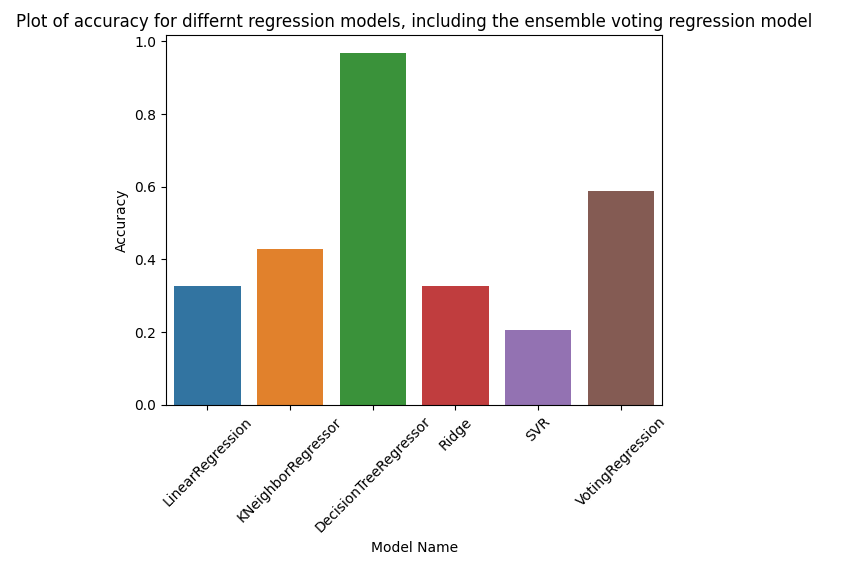
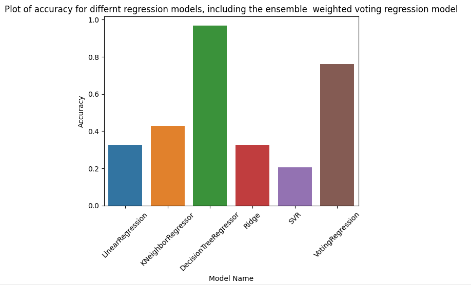

# Comparing-Ensemble-Models

## Following steps were used

### Display the first few rows to understand the data

### Normalize the WAGE

### One hot encoding for the columns

### Plotting the accuracy results

